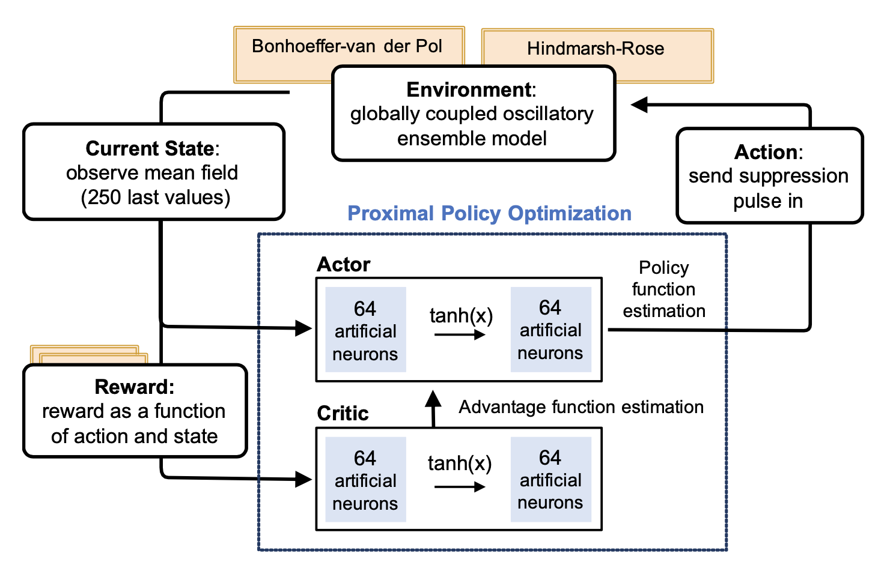

[](https://www.apache.org/licenses/LICENSE-2.0)
[](https://python.org)

# RL-DBS
# Reinforcement learning for suppression of collective neuronal activity in Deep Brain Stimulation (DBS) systems

This is a convenient gym environment for developing and comparing interaction of RL agents with several types of synthetic neuronal models of pathological brain activity. The ODEs that simulate neuronal signals are wrapped into the framework as individual environments, allowing to switch easily between environments, and to use various RL models and multiple agents. 

The suppression workflow proposed here is universal and could be used to create benchmarks among different physical models, to create different control algorithms, and to pave the way towards clinical realization of deep brain stimulation via reinforcement learning. The policy gradient algorithm PPO can provide a robust data-driven control, agnostic of the neuronal model.

We propose a class of physically meaningful reward functions enabling the suppression of collective oscillatory mode. The synchrony suppression is demonstrated for two models of neuronal populations – for the ensembles of globally coupled limit-cycle Bonhoeffer-van der Pol oscillators and for the bursting Hindmarsh–Rose neurons.

<p align="center">

</p>
<p align="center">
<em>Principle diagram of Reinforcement Learning via PPO Actor-Critic algorithm.</em>
</p>


### Installation as a project repository:

```
git clone https://github.com/cviaai/RL-suppression-in-oscillatory-ensembles.git
```

In this case you need to manually install the dependencies.

### There are few important notes:

Notebook file Baseline shows how model interacts with environment and in this notebook you can find an example of trained model and training.

Environment uses Gym Notation, class that describes all information is 
```
gym_oscillator/envs/osc_env.py
```
A C++ code that creates oscillations is the following:
```
/source_for_build_files/gfg.c
```
## Citing 

If you use this package in your publications or other work please cite the package as follows:

```
Dmitrii Krylov, Remi Tachet, Romain Laroche, Michael Rosenblum and Dmitry V. Dylov 2020.
```

```
@misc{krylov-RL-DBS,
    title={Reinforcement Learning Framework for Deep Brain Stimulation},
    author={Dmitrii Krylov and Remi Tachet and Romain Laroche and Michael Rosenblum and Dmitry V. Dylov},
    year={2019},
    eprint={1909.12154},
    archivePrefix={arXiv},
    primaryClass={q-bio.NC}
}


```
